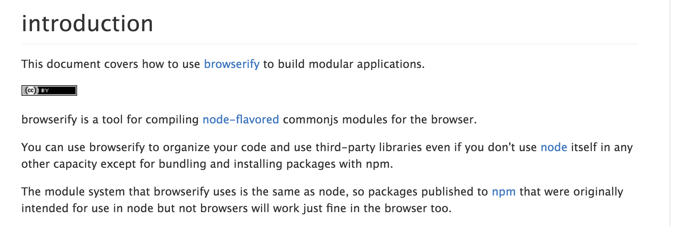
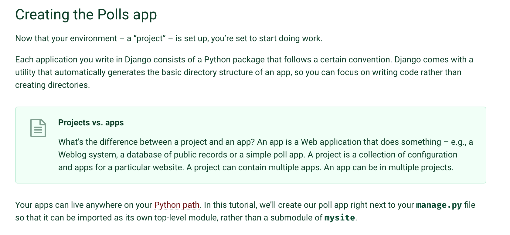

# Patterns Common in Exemplary Docs

### Context & Introduction

**Frequent context-setting, including brief definitions of potentially unfamiliar terms and introductory statements about the shared problems the project is intended to solve and how it solves them.**

https://docs.djangoproject.com/en/1.10/intro/overview/

https://github.com/substack/browserify-handbook

https://docs.djangoproject.com/en/1.10/intro/tutorial01/#creating-the-polls-app

https://learn.jquery.com/

### Examples Galore

**Plentiful examples and tutorials with credible real-world goals.**

http://php.net/manual/en/intro-whatis.php

https://docs.djangoproject.com/en/1.10/topics/db/models/

https://docs.djangoproject.com/en/1.10/intro/tutorial01/

## Full List of patterns

* Completeness balanced with concision
* Optional depth, including rationale, links to source, and asymmetically deep dives on complex topics*
* Plentiful examples and tutorials with credible real-world goals*
* Frequent context-setting, including brief definitions of potentially unfamiliar terms*
* Statements (usually in intro) about the shared problems the project is intended to solve and how it solves them* (merged up)
* Clear TOC and information structure, and high-quality search
* Specific, unintimidating invitations to participation
* Ordered step-lists and prerequisite/environment checklists*
* Unobtrusively encouraging tone
* Designed for both easy topic-finding and more in-depth reading

(* good candidates for building out in more detail)