We envision the OS Playbook landing somewhere between a traditional set of tech docs and a set of explanatory blog posts (or Source articles) breaking down what you, its authors, have learned about open sourcing projects in newsrooms. To help you get started, we've sketched some "playbook modules" that we've noticed working well in other documentation so that if you're not certain how to begin (or continue), you can refer back to this list for some fruitful options.

# PLAYBOOK MODULES

# Section Orientation/Context
States explicitly what this section or subsection of the playbook is about and what it will do, and for whom. A lot of well organized docs include this, but few do it as consistently and explicitly as the [Django docs](https://docs.djangoproject.com/en/1.10/intro/overview/).

From the [Django overview](https://docs.djangoproject.com/en/1.10/intro/overview/):

> 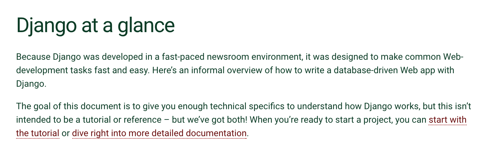

From the [Browserify handbook introduction](https://github.com/substack/browserify-handbook):

> 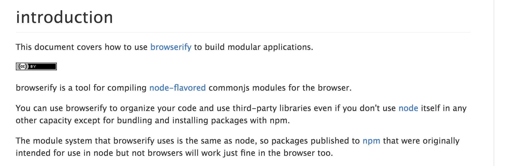

From within a [Django topical tutorial](https://docs.djangoproject.com/en/1.10/intro/tutorial01/#creating-the-polls-app):
> 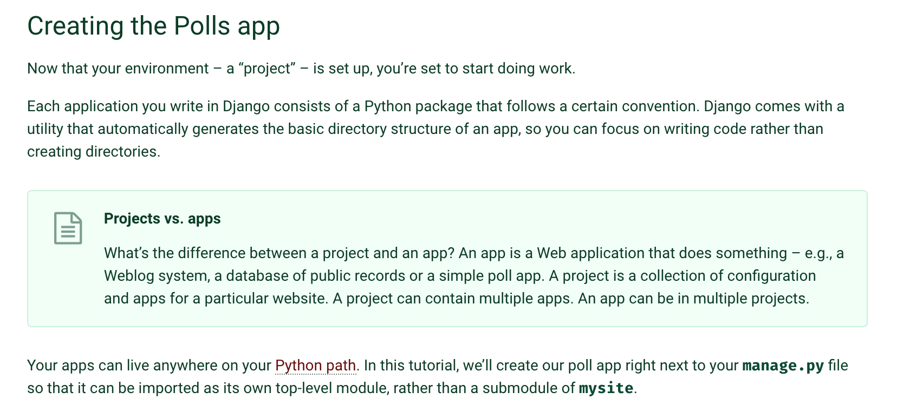

You may also want to include optional branching: if X, skip to section Y.

An audience-based branch at the top level, from the [jQuery docs](https://learn.jquery.com/):
> 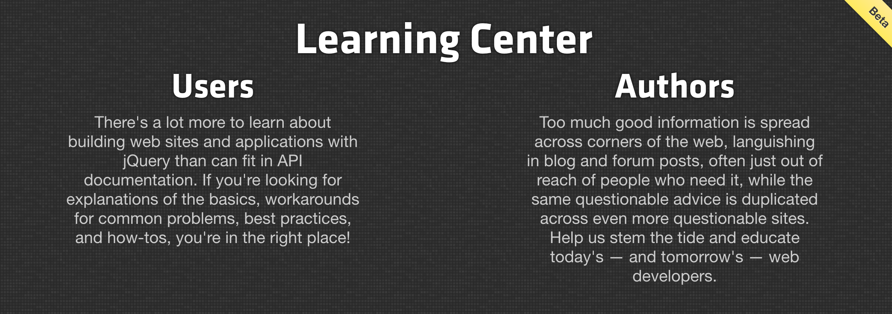

From [Django](https://docs.djangoproject.com/en/1.10/#index-first-steps), a way to easily skip to the part you need, from within the introduction:

> 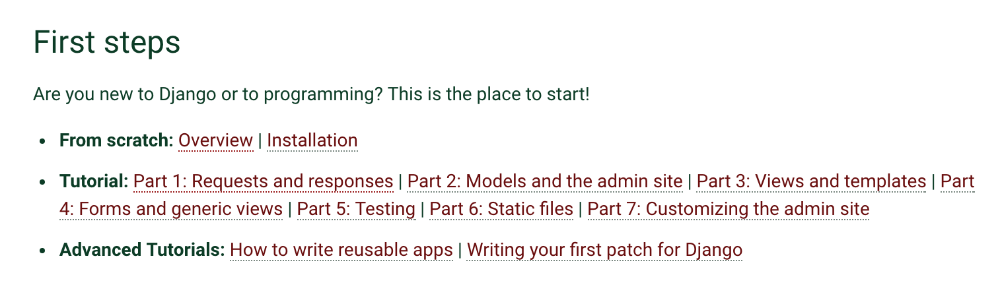

# Topic-Level Section
[Topic] is [definition]. It's important because [why].

A topic intro from, surprise!, [Django](https://docs.djangoproject.com/en/1.10/topics/db/):
> 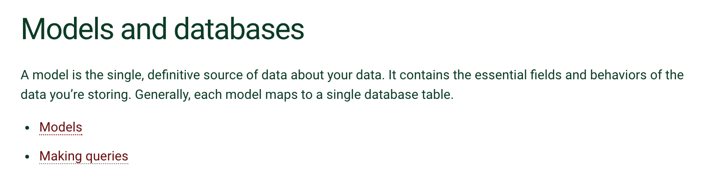

## Point or principle
1-2 grafs explaining the principle, generally—longer prose will be friendlier if broken into subsections or interspersed with examples (or both).

### Example or Narrative
Scenario, anecdote, code snippet, diagram, whatever is useful. This is a fine place for the kind of example you see in technical documentation, but it's also a good place for you to relate how you handled a relevant part of an open source project yourself, and what you learned along the way. 

[Getting to the examples right away in PHP:](http://php.net/manual/en/intro-whatis.php)
> 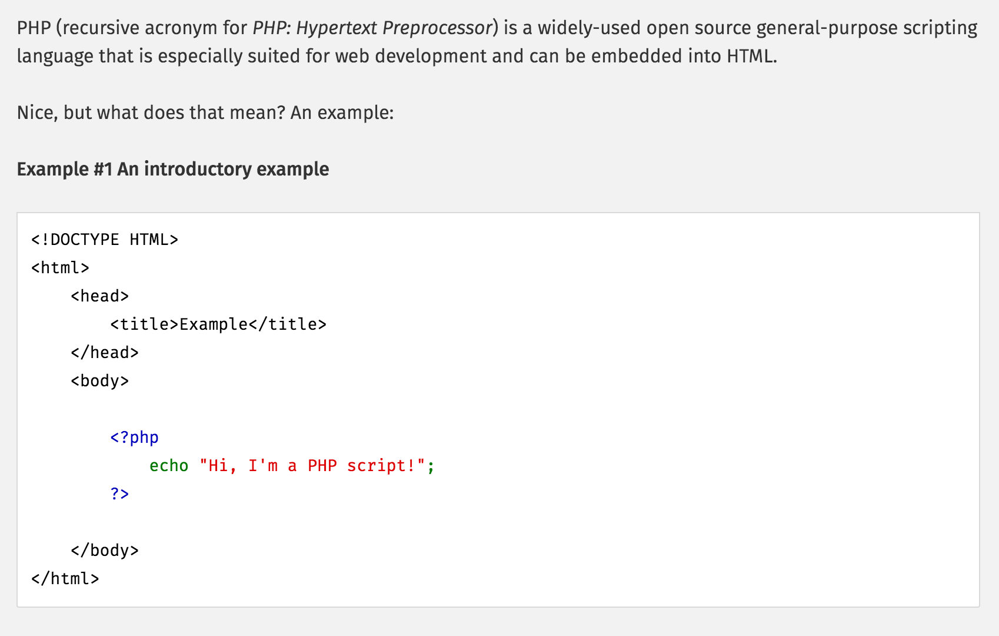

[Django's "quick example" format:](https://docs.djangoproject.com/en/1.10/topics/db/models/)
> 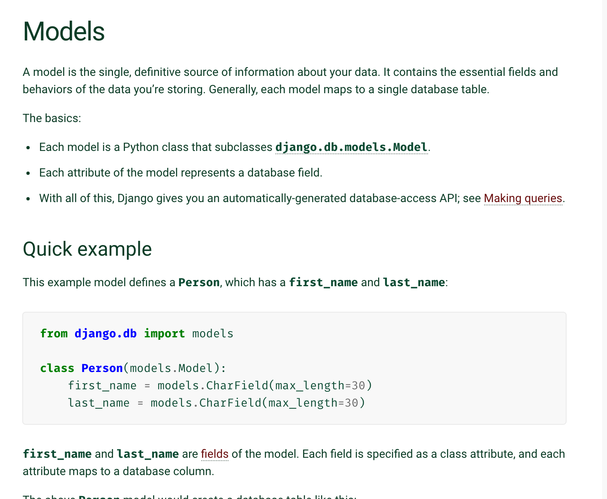

[From the csvkit introductory tutorial:](https://csvkit.readthedocs.io/en/540/tutorial/1_getting_started.html)
> 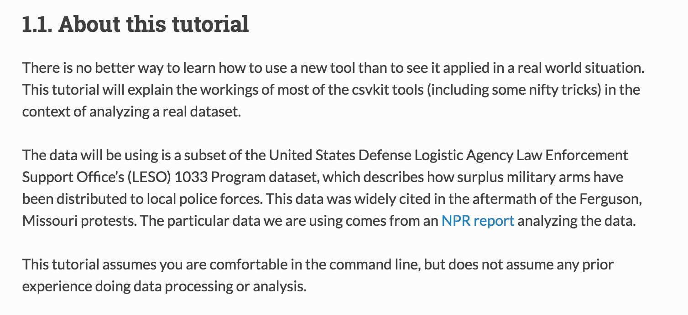

### Optional extras

* A deeper detail or more advanced take on a point, likely also illustrated with an example.
* Inline definitions (may be in a literal callout box), helpful not only when using arcane terms, but also when you want to distinguish between two similar ideas. 

### Summary or "what's next?" guidance, if needed

[From agate's tutorial:](http://agate.readthedocs.io/en/latest/tutorial.html#where-to-go-next)
> 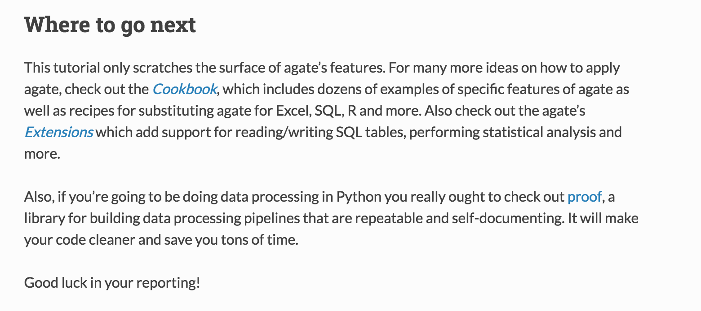

[A Django wrap-up:](https://docs.djangoproject.com/en/1.10/intro/tutorial07/#what-s-next)
> 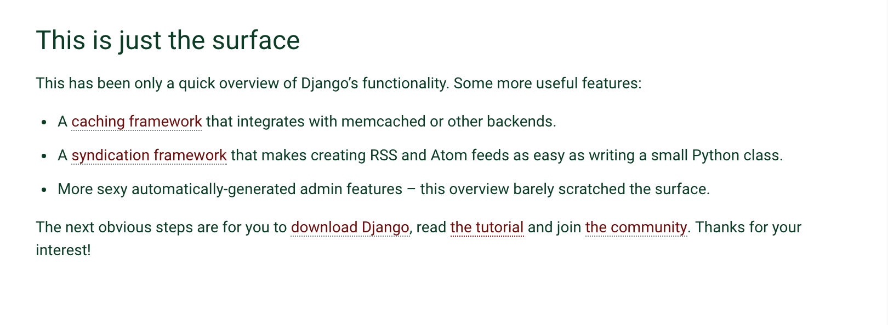
 